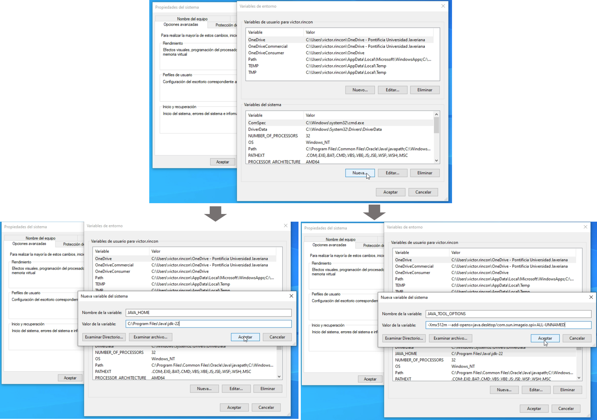

Guía de instalación Makurhini - IAvH
================
Makurhini es una librería de R diseñada para la evaluación y
planificación de la conectividad ecológica [Godínez-Gómez & Corre Ayram,
2020](https://github.com/connectscape/Makurhini).

Makurhini proporciona un conjunto de funciones para identificar la
conectividad de redes de áreas protegidas y la importancia de los
elementos del paisaje para mantener dicha conectividad. Este paquete
permite la evaluación de escenarios bajo cambios en la conectividad del
paisaje y presenta una mejora adicional: la inclusión de la
heterogeneidad del paisaje como un factor limitante para la
conectividad. Este repositorio está diseñado para integrar los análisis
de conectividad realizados con Makurhini en el Instituto de
Investigación de Recursos Biológicos Alexander von Humboldt. Este README
principal describe cómo instalar paso a paso Makurhini siguiendo la guía
proporcionada por el repositorio oficial disponible en
[connectscape/Makurhini](https://github.com/connectscape/Makurhini),
pero con algunas aclaraciones que facilitan su instalación en Windows
para todos los investigadores.

- [Instalación de java](#instalación-de-java)
- [Configuración de variables de
  entorno](#configuración-de-variables-de-entorno)
- [Instalación en R](#instalación-en-r)

## Instalación de java

Makurhini requiere `Java` para su funcionamiento debido a que algunas de
sus funciones dependen de bibliotecas y herramientas que están
implementadas en Java. Estas herramientas son esenciales para manejar y
procesar datos espaciales y para realizar análisis de conectividad
ecológica de manera eficiente.

Para descargar e instalar `Java`, se debe descargar el instalador
`Java JDK` para Windows desde el [sitio web oficial de Oracle
Java](https://www.oracle.com/java/technologies/downloads/#jdk22-windows).

Después de la descarga, ejecuta el archivo de instalación y sigue las
instrucciones en pantalla para completar el proceso. Durante la
instalación, asegúrate de anotar la ruta de instalación, ya que
necesitarás esta información para configurar la variable de entorno
posteriormente para el correcto funcionamiento de Makurhini.


## Configuración de variables de entorno

Es necesario configurar las variables de entorno `Java` para asegurarse
de que el sistema operativo y las aplicaciones, como Makurhini, puedan
localizar y utilizar `Java` correctamente. Sin la configuración
adecuada, estas funciones pueden no ejecutarse correctamente.

- 1.  Abrir Configuración de Variables de Entorno: Busca en tu
      computadora la opción `Variables de entorno` o
      `Editar las variables de entorno del sistema`. Esto abrirá el
      cuadro emergente sobre `Propiedades del sistema`. Allí, haz clic
      en `Variables de entorno`.


- 2.  Configurar `JAVA_HOME` y `JAVA_TOOL_OPTIONS`: En el cuadro que se
      abre de `Variables de entorno`, en la sección inferior sobre
      `Variables del sistema`, haz click en `Nueva`. Allí, crea una
      variable con el nombre `JAVA_HOME` y en el valor ingresa la ruta
      del folder instalación del `JDK` en tu computadora, por ejemplo,
      `C:\Program Files\Java\jdk-22`. Luego, crea otra variable nueva
      llamada `JAVA_TOOL_OPTIONS` con el valor
      `-Xmx512m --add-opens=java.desktop/com.sun.imageio.spi=ALL-UNNAMED`.



## Instalación en R

De acuerdo con la documentación provista por [Godínez-Gómez & Corre
Ayram, 2020](https://github.com/connectscape/Makurhini) la instalación
de Makurhini se hace directamente desde repositorio GitHub, por lo que
requiere la instalación previa de las librerias `devtools` y `remotes`.
Una vez que estas librerías están instaladas, se puede usar la función
`install_github` para instalar Makurhini. Las siguientes líneas de
código verifican si las librerías necesarias están instaladas y, si
Makurhini no está presente en tu máquina, lo instalan:

``` r
# Verificar e instalar devtools y remotes si no están instalados
if (!requireNamespace("devtools", quietly = TRUE)) install.packages("devtools")
if (!requireNamespace("remotes", quietly = TRUE)) install.packages("remotes")

# Instalar Makurhini desde GitHub si no está instalado
if (!requireNamespace("Makurhini", quietly = TRUE)) {
  remotes::install_github("connectscape/Makurhini", dependencies = TRUE, upgrade = "never")
}
```

``` r
Installing package into ‘C:/Users/victor.rincon/AppData/Local/R/win-library/4.4’
(as ‘lib’ is unspecified)
* installing *source* package 'Makurhini' ...
** using staged installation
** R
** data
*** moving datasets to lazyload DB
** inst
** byte-compile and prepare package for lazy loading
** help
*** installing help indices
*** copying figures
** building package indices
** installing vignettes
** testing if installed package can be loaded from temporary location
** testing if installed package can be loaded from final location
** testing if installed package keeps a record of temporary installation path
* DONE (Makurhini)
```

Este proceso garantiza que Makurhini se instale correctamente y todas
sus funciones funcionen de manera óptima, asegurando que las
dependencias necesarias estén presentes y configuradas adecuadamente en
tu sistema.
